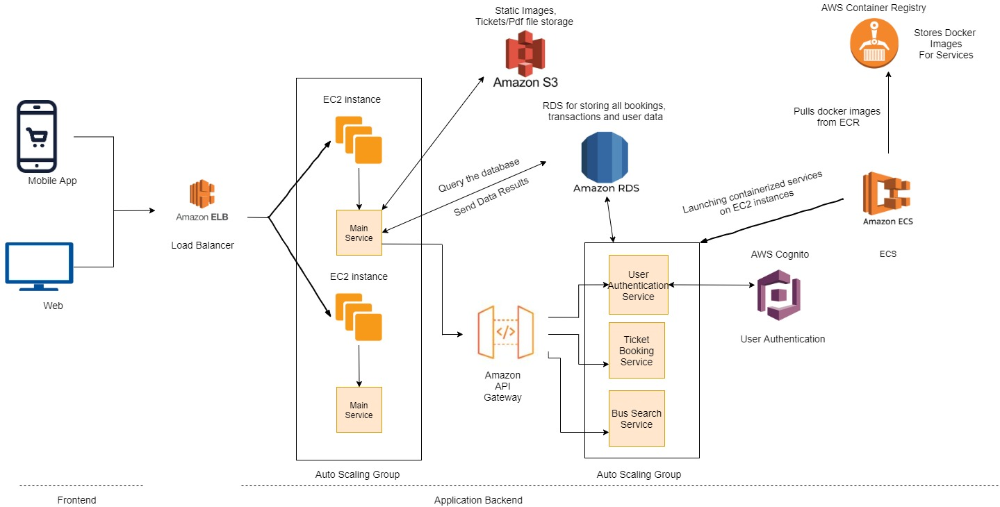

# TravelApp

### Travel Booking Website to book Bus Tickets for the famous Tourist Desitnations - Main focus was onto implement different cloud technologies

**Technologies Used:**
1. Python
2. Flask Framework
3. Javascript
4. AWS - EC2 (Linux Instance), Elastic Container Service, Docker files were in ECR (Elastic Container Registery), S3 (File Storage), API Gateway, RDS (Relational Database), Congito (For User Authentication), ASG (Auto Scaling Group), ELB (Elastic Load Balancer), CLoud Watch Monitor (For monitoring cloud services).
5. Containers: Docker
6. Database - PostgreSQL

Architecture:

