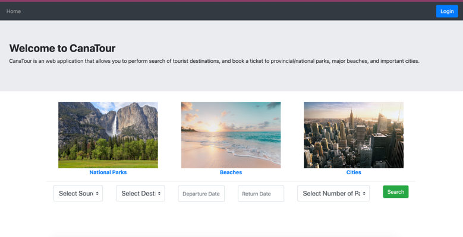

# TravelApp

### Travel Booking Website to book Bus Tickets for the famous Tourist Desitnations - Main focus was onto implement different cloud technologies using Microservices Architecture

**Technologies Used:**
1. Python
2. Flask Framework
3. Javascript
4. AWS - EC2 (Linux Instance), Elastic Container Service, Docker files were in ECR (Elastic Container Registery), S3 (File Storage), API Gateway, RDS (Relational Database), Congito (For User Authentication), ASG (Auto Scaling Group), ELB (Elastic Load Balancer), CLoud Watch Monitor (For monitoring cloud services).
5. Containers: Docker
6. Database - PostgreSQL

Architecture:

###Features of different services:

Main Service: This is our controller service, that manages all input requests and directs those requests towards services that handle them. After the required processing, the REST APIs return JSON outputs to the main service, which then renders the response to the user. It performs various pre-validations and handles the requests efficiently.  Also this is the service which interacts with API gateway if needed.  

User Authentication: Using Amazon Cognito [10], we perform user authentication while a user signs up and login. During sign up, we collect user details of the user and store them in the ‘userdetails’ table of our Database. But password and username details are only stored in Cognito and there is a 2-way authentication to sign-up. A user receives a unique code on the email, and only when the user inputs that code, their user account gets created successfully. 

Search Bus: This service deals with one of our main functionalities, searching for buses that travel to the destination. When a user chooses the destination, the travel date and the number of seats in the bus, all these details are captured and using these details, the backend hits the database with a custom query that retrieves all the schedule details as per the search criteria, and renders it onto the screen for the user to view and choose. If all the fields are not filled, an error is thrown. At the beginning of this service, the API connects to the database using the library psycopg2 [11].  

Ticket Booking: A user can book a ticket only when logged in. Using a user’s token ID, we authenticate if a user has logged in, in that session and only then let them book a bus ticket. Upon successful validation of the card details, a ticket can be booked. After fetching the details required to book a ticket, we insert a record in the tickets table which has the details of the booking.  

Screenshot of the Landing Page:

